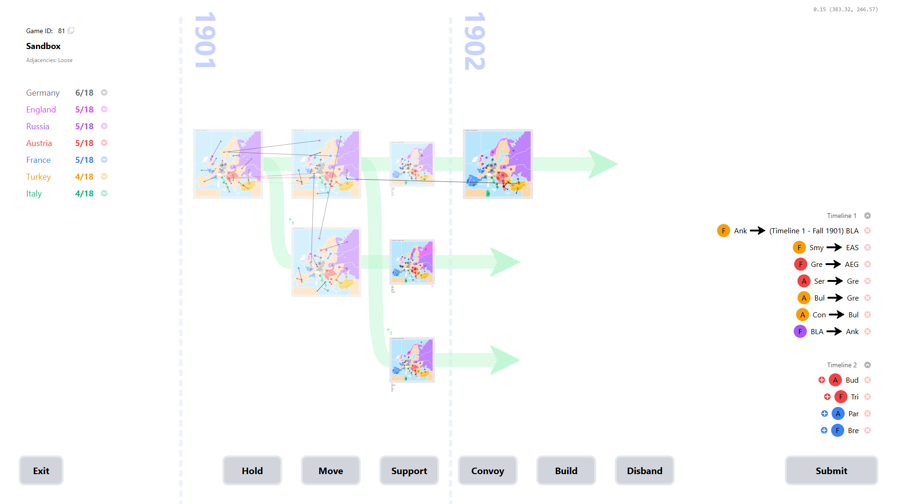

# 5D Diplomacy With Multiverse Time Travel

A new standard in measuring how galaxy-brained you are, 5D Diplomacy With Multiverse Time Travel combines the classic game of pure negotiation with the modern classic game of pure disorientation. Can you convince your opponent to support an attack in the present while simultaneously backstabbing them five years ago and seven timelines over?

Inspired by and indebted to the board game [Diplomacy](https://instructions.hasbro.com/en-us/instruction/avalon-hill-diplomacy-cooperative-strategy-board-game) and the video game [5D Chess With Multiverse Time Travel](https://www.5dchesswithmultiversetimetravel.com/). Both are excellent in their own right, so we recommend picking up a copy of each to understand the rules for 5D Diplomacy.

_Diplomacy_ is a trademark of Avalon Hill. _5D Chess With Multiverse Time Travel_ is a trademark of Thunkspace, LLC. _5D Diplomacy With Multiverse Time Travel_ and its creators are not affiliated with either _Diplomacy_ or _5D Chess With Multiverse Time Travel_.

## Contributing

If you find a bug, please raise an [issue](https://github.com/Oliveriver/5d-diplomacy-with-multiverse-time-travel/issues).

If you have design questions or suggestions, please don't use the issue board and instead use the [5D Diplomacy Discord server](https://discord.gg/g7TvjPfkVu).

Code contributions from others are welcome, although the creators retain the right to refuse feature changes. Feel free to fork this repo and modify the code there if you wish to experiment with more radical changes to the rules or UI.

## Installation

There are currently two options for installing 5D Diplomacy. If you wish to make code changes as part of your installation, you should use the manual installation option. Otherwise, installation via Docker may be more suitable.

### Manual Installation

The two components - found in the `server` and `client` directories - may be run together or independently. The client always requires a server instance (local or remote) for the game to function beyond the welcome and setup screens.

The `prototype` directory contains the original proof of concept from 2021. None of its contents are required for running the latest version of 5D Diplomacy.

#### Server

Requirements:

- [.NET SDK 8.0](https://dotnet.microsoft.com/en-us/download/dotnet/8.0).
- [Entity Framework Core command line tools](https://learn.microsoft.com/en-us/ef/core/cli/dotnet). If .NET has been installed, these can be installed by running `dotnet tool install --global dotnet-ef`.
- A blank database instance running on [SQL Server](https://www.microsoft.com/en-gb/sql-server/sql-server-downloads). We recommend using SQL Server Developer Edition or SQL Server Express Edition as they're both free.

Steps:

- Navigate to the `server` directory.
- Copy `appsettings.json` to a new file in the same directory, `appsettings.Development.json`, and inside the new file, replace `DATABASE_CONNECTION_STRING` with the connection string for the active database instance.
- Run `dotnet build`.
- Run `dotnet ef database update`.
- Run `dotnet run` to start the server.

#### Client

Requirements:

- [Node.js](https://nodejs.org/en/download/prebuilt-installer).
- [Yarn package manager](https://yarnpkg.com/). If Node.js has been installed, this can be installed by running `npm install --global yarn`.
- A running instance of the server, whether local or remote.

Steps:

- Navigate to the `client` directory.
- Copy `.env` to a new file in the same directory, `.env.local`, and inside the new file, replace `SERVER_URL` with the base domain of the active server instance.
- Run `yarn install`.
- Run `yarn dev` to start the client in the default browser.

### Installation via Docker

Requirements:

- [Docker](https://docker.com/) and [Docker Compose](https://docs.docker.com/compose/). Note that Docker Compose will generally be installed alongside Docker automatically.

Steps:

- Ensure Docker is running.
- Run `docker compose build frontend backend`.
- Run `docker compose up -d`.
- Wait at least a minute for the database to initialise. If you encounter errors creating games after opening the client, you may need to wait longer.
- Access the game client at http://localhost:5173.

To read server logs, run `docker compose logs -f backend`. Database files will be stored in `mssql-data` directory.

If you ever update the code (manually or via a pull from this repository), you will need to run `docker compose down --rmi local`, then run through the steps above again.

## Gameplay

For a basic demonstration of the game and how to play, see [the accompanying video](https://www.youtube.com/watch?v=P_5QCJO4ELI).

### Setup

First see installation instructions above. 5D Diplomacy can be set to run normal games (where seven players join and enter orders individually) or sandbox games (where a single user enters all orders).

If you wish to play a normal game or let other people see one of your sandbox games, you'll need to expose the domains of your client and/or server (if everyone has set up the client themselves, only a server needs to be exposed). There are various ways to do this, although this guide does not cover them.

#### Normal Game

To create a normal game, one player must choose the new game option from the main menu. They must choose the adjacency setting (see game rules below). After a game has been created, the initiating player enters the game and sees the game ID in the top left corner, which they must copy and send to other players.

Other players can then use the join game option from the main menu to join with the supplied game ID.

Note that 5D Diplomacy has no in-built messaging system. Unless you want to play without press, you require a separate program to send and receive press, e.g. a messaging app or voice calls.

A possible exploit exists when playing multiplayer games. Since 5D Diplomacy has no user logins or verification, a player can join as someone else and enter their orders before them. The alternative - allowing each nation to join only once - would mean players can't rejoin after a break or connection issues. While Diplomacy is a game about breaking trust, you'll simply have to trust players not to be quite this devious.

#### Sandbox Game

To create a sandbox game, select new game from the main menu and choose the sandbox option. Also set the adjacency setting (see game rules below).

In sandbox mode, turns advance after submission whether all nations have orders or not.

### Game Rules

The rules of 5D Diplomacy generally extend the rules of regular Diplomacy. This guide covers only deviations from the rules of the base game.

The game world consists of a grid of Diplomacy boards. Each row is a timeline, and each timeline progresses with boards following the standard Diplomacy turns (Spring 1901, then Fall 1901, then Winter 1901, then Spring 1902, etc.).

#### Order Entry

At a given time, only units on the active boards (those furthest to the right in each timeline) can have new orders assigned. Other units are locked into their pre-existing orders, which can't be changed, though their resolution can.

Units in spring or fall turns can be given hold, move, support or convoy orders. These are validated against standard Diplomacy adjacency rules, with extra possibilities for multiverse travel. The adjacency strictness setting (chosen when a new game is created) determines how units can move through the multiverse.

With strict adjacencies, a unit can move/support/convoy to:

- Any adjacent region on its own board.
- The same region on a different board exactly one timeline up or down, e.g. moving from Paris in Timeline 2 to Paris in Timeline 1.
- The same region on a different board exactly one board in the past, e.g. moving from Berlin in Fall 1901 to Berlin in Spring 1901. Note that moving to winter boards is forbidden and these are skipped when determining board adjacencies, so Spring 1902 is adjacent to Fall 1901.
- Any region it is successfully convoyed to (see below).

With loose adjacencies, a unit can move/support/convoy to:

- Any adjacent region on its own board.
- The same region on a different board exactly one timeline up or down, or any region adjacent to that region within its board, e.g. moving from Paris in Timeline 2 to Gascony in Timeline 1.
- The same region on a different board exactly one board in the past, or any region adjacent to that region within its board, e.g. moving from Berlin in Fall 1901 to Kiel in Spring 1901. Winter boards are still ignored.
- Any region it is successfully convoyed to (see below).

In either case, note in particular that movement one board diagonally is not permitted (without a convoy).

Convoys extend the quirk of standard Diplomacy that allows armies to move an arbitrary distance in a single turn if a chain of convoying fleets exists. Providing each fleet is adjacent to the next and all are ordered to perform the same convoy, an army could go almost anywhere.

Units are however forbidden from moving into boards that don't exist yet, even with convoys. Convoys and supports though can anticipate a future unit moving back in time, so the player can use the ghost board to enter supports/convoys via an arbitrary location in the multiverse.

Any units in (spring or fall) boards not assigned orders are given a hold order by default.

#### Adjudication

The rule of thumb for adjudication: each time all orders for a turn are submitted, all orders in the entire world are adjudicated together, as if in a single enormous Diplomacy board.

In particular, new orders could affect a prior resolution of existing orders, e.g. a unit that bounced now has support and so moves successfully. This extends to supports/convoys across time, e.g. convoys that were previously invalid may become valid if the future army appears and performs the expected move.

For a given board:

- If the new resolution matches an existing child board that spawned from this one, then no new timeline splits. So if two units bounced and both receive one new support from their relative future next turn, they still bounce and no new board is created (assuming no other changes elsewhere on this board).
- If the new resolution does not match an existing child board that spawned from this one, a new timeline appears. New timelines always appear below all existing timelines, and are always created in a canonical order (earliest board first; if boards are of equal age, lowest timeline number first).

Note that this is different to 5D Chess where boards can spawn above or below existing timelines, potentially changing the coordinates of existing boards. There's no concept of a turn belonging to a player in Diplomacy (instead, they belong to everyone simultaneously) and 5D Diplomacy extends this thinking, so timelines spawn in only one direction. Board coordinates also never change.

Main turns (spring and fall) and winter boards adjudicate simultaneously if all are at the end of their respective timelines. So a player may be creating builds on one board and creating moves on another in the same turn. Though of course these must be kept separate, so building is not permitted on movement boards and vice versa.

Build/disband counts are per board. If a player controls fewer centres than they have units in one timeline but more in another, the difference does not cancel out: they must disband in the former and may build only in the latter. If they fail to enter enough disbands on a given board, units are removed from that board at random.

If any board requires retreats, adjudication pauses for all boards without retreats. Retreats may only move to an adjacent region on the same board.

#### Victory Condition

A player achieves victory under one of the following conditions:

- They are the only player to control at least 18 unique supply centres across all active boards. Unique here means unique by region name, so controlling Serbia in Timeline 1 and Serbia in Timeline 2 counts as only one supply centre.
- If more than one player controls more than 18 unique supply centres, they are the only one with a clear majority. It's possible for two players to reach 18 centres in the same turn, e.g. if they have targeted different timelines.

## Variants

As with regular Diplomacy, it's possible for 5D Diplomacy to feature variant maps with completely different region arrangements. Other variants, such as variants with new rules, are not supported.

Modifying the server to adjudicate custom variants in 5D is simple. First, edit the list of nations in `server/Enums/Nation.cs`. Then edit the JSON files in the folder `server/Data` to match the intended board. Any subsequent run of the server will use those to create and adjudicate worlds.

- Modify `centres.json` to change supply centres and starting/home centres.
- Modify `connections.json` to change connections between regions.
- Modify `regions.json` to change regions.
- Modify `units.json` to change starting units.

Modifying the client is tricker as it is much more tied to this particular Diplomacy board. While `client/src/data/regions.ts` contains the list of regions and associated data, you will also need to replace the SVG files in `client/src/assets/map` and then reference them in `client/src/hooks/useRegionSvg.tsx`.
